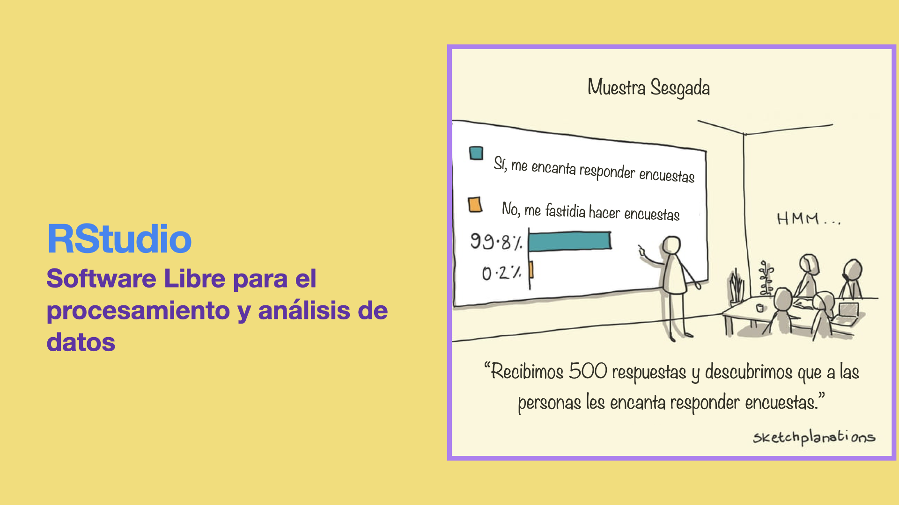

```{r setup, include=FALSE}
library(learnr)
knitr::opts_chunk$set(echo = FALSE)
knitr::include_graphics
```


# Introducción a R y RStudio

## Inicio

*¿Quién va a deternerte?*  
*La muerte, la edad o la idea.*  
*Sara Hebe*


{width='520px'}


## R

R es un proyecto de Licencia Pública General ([GNU](https://es.wikipedia.org/wiki/GNU_General_Public_License) por sus siglas en inglés) de características similares al lenguaje S que le antecede. Fue desarrollado en los Laboratorios Bell (antes AT&T) por John Chambers y colegas, basándose en S, pero con una visión de Software libre. 

R ofrece una variedad de herramientas para el cálculo estadístico y la visualización de información, puede usarse en diversidad de plataformas computacionales. Usuarios individuales, instituciones e industrias diversas han adoptado R para tareas de biotecnología, finanzas, investigación y tecnología.

R está disponible bajo los términos de Software Libre GNU, permite definir y agregar nuevas funciones y es facilmente extendible via "packages". Diversas herramientas que cubren un amplio rango de tareas estadísticas pueden descargarse diversos packages desde los sitios [CRAN](https://cran.r-project.org) (Comprehensive R Archive Network).

https://cran.r-project.org/manuals.html

https://www.r-project.org

*Ubica el cursor dentro del "chunk" de código, corre el código con "Ctrl+Enter" o haciendo click en "Run code" para ver la versión de R en esta computadora*

```{r version, exercise=TRUE}
version

```

## RStudio

RStudio es un entorno de desarrollo integrado (IDE por sus siglas en inglés)  que proporciona una interfaz gráfica que facilita el uso de R, incluye consola, editor de sintaxis que permite la ejecución de código, así como herramientas para la graficación, organización de archivos, etc.

RStudio es una compañía privada fundada en 2009 por J.J. Allaire. Su misión es crear software libre para la ciencia de datos, la investigación científica y la comunicación técnica. Esto con el objetivo de que cualquier persona, sin importar su economía, pueda acceder a las herramientas del conocimiento, además de facilitar la colaboración y reproducibilidad en la investigación. Para RStudio esto último es crítico para la eficacia en las tareas científicas, educacionales, gubernamentales e industriales.

RStudio is available in open source and commercial editions and runs on the desktop (Windows, Mac, and Linux) or in a browser connected to RStudio Server or RStudio Workbench (Debian/Ubuntu, Red Hat/CentOS, and SUSE Linux).

Visita:  
https://www.rstudio.com  
https://rladies.org  


*Ubica el cursor dentro del "chunk" de código, corre el código con "Ctrl+Enter" o haciendo click en "Run code" para ver la versión de RStudio en esta computadora*
```{r version_RStudio, exercise=TRUE}
rstudioapi::versionInfo()

```


## Sintaxis básica

Las entidades que crea y manipula R son conciderados "objetos" (objects). Estos pueden ser variables, arreglos de números, cadenas de caracteres, funciones, o estructuras construidas a partir de estos componentes.


*R puede usarse como calculadora. Usando el siguiente código calcula $5x3^2+10$. Escribe y calcula otras operaciones con números*

```{r two-plus-two, exercise=TRUE}
5*3^2+10

```

*Podemos definir variables sin necesidad de declararlas*

```{r variables, exercise=TRUE}
# <- es el un simbolo para asignar valores
x <- 4
y <- 5
z <- (x+y)^2
#Mostramos el valor de z
z
#Para eliminar las variables 
#rm(x,y,z)
```


### Vectores
Una de las estructuras más simples de R es un vector de números.

*Definiremos un vector llamado v que contendrá los números 10.4, 5.6, 3.1, 6.4 y 21.7.*
```{r vector, exercise=TRUE}
#  La función c() concatena sus argumentos
v <- c(10.4, 5.6, 3.1, 6.4, 21.7)
# Mostramos la variable v
v
# Mostramos el primer elemento de v
v[1]
```

*En R, distintas operaciones aritméticas pueden realizarse sobre vectores.*

```{r operaciones_vectores, exercise=TRUE}
# Generamos el vector (1, 2,..., 10)
a <- 1:10
# Generamos un vector 2 repetidos 10 veces
b <- rep(2,10)

a
b
5*a
a+b
a*b
a==b
```

*Con las siguientes funciones, entre otras, obtenemos características de los objetos.*

```{r meta_vectores, exercise=TRUE}

a <- -3:2
a
# Longitud del vector a
length(a)
# Tipo de objetos que contiene el vector a
typeof(a)

b<- rep(0, length(a))
b

# Tipo de objetos que contiene el vector a==b
typeof(a==b)

```


### Funciones

Podemos definir nuevas funciones

*Definimos una nueva función "NuevaFuncion" que suma dos números. Obseva su funcionamiento y modifícala para obtener la multiplicación de los argumentos.*

```{r funcion, exercise=TRUE}
NuevaFuncion <- function(argumento1, argumento2) {
  argumento1+argumento2
}

NuevaFuncion(3,5)
```

### Listas

Las listas son conjuntos ordenados de objetos que pueden ser de naturaleza distinta: números, texto (que debe ir entre " "), vectores, etc.

```{r listas,  exercise=TRUE}
L <- list("Hola", "mundo", 5, 1:3)
L
typeof(L)
```

## Data Frames

Podemos pensar un data frame como una matriz cuyas columnas pueden tener distintas características.

*R contiene varias data frames precargadas con las que podemos practicar:*


```{r dataframe, exercise=TRUE}
#Tipo de objeto mtcars
typeof(mtcars)
# Clase de obeto mtcars
class(mtcars)
# Ayuda sobre mtcars
?mtcars
#Visualizando el objeto mtcars
mtcars
```

Con las funciones "head", "tail", "summary", "[]", "$", etc.  podemos leer y seleccionar información de una data frame.

*Prueba las distintas herramientas para manejo de data frames modificando los siguientes códigos*

```{r dataframedos, exercise=TRUE}
head(mtcars)
```

```{r dataframetres, exercise=TRUE}
mtcars[[2,3]]

```

```{r dataframecuatro, exercise=TRUE}
mtcars$cyl

```

## Simulación de datos aleatorios 

En RStudio busca en las herramientas de la aplicación la pestaña "Files".

Abre el archivo "Intervalos Confianza.R" haciendo click sobre el nombre.  Regresa a este Tutrial al terminar.  

Abre el archivo "Intervalos Confianza.R", vuelve a este tutorial al terminar.  

## Pruebas de hipótesis

Abre el archivo "PruebaHipotesis_Ejemplo.R", contesta a las preguntas allí contenidas. Vuelve a este tutorial al terminar.

## Quiz Introducción a R y RStudio

*Elige todas las respuestas correctas.*

```{r Quiz_I}
quiz(
  question("Elige todas las respuestas correctas",
    answer("R y RStudio son para gente que puede pagar licencias y cursos caros de programación"),
    answer("Cualquiera que tenga un equipo de cómputo adecuado puede aprender y usar R y RStudio, así como acceso a tutoriales y foros gratuitos.",  correct = TRUE),
    answer("R es sólo para gente con formación en programación y sistemas computacionales."),
    answer("La Rosalía combina el rojo con el rosa",  correct = TRUE),
    answer("En su álbum -Un Verano Sin Ti- el reggetonero Bad Bunny educa acerca del concentimiento y la lucha feminista.", correct = TRUE)),
  question("¿Quién a va a detenerte para aprender R y RStudio?",
    answer("la muerte"),
    answer("la edad"),
    answer("la idea"),
    answer("ninguna de las anteriores, hasta la victoria siempre", correct = TRUE)
  )
)
```


## Modelos Lineales

R cuenta con diversas herramientas para ajustar modelos lineales. Para ver algunos ejemplos de esto abre el archivo "lineal.R". Regresa a este tutorial al terminar.

Visita:  
https://www.institutomora.edu.mx/testU/SitePages/martinpaladino/modelos_lineales_con_R.html  
http://r-statistics.co/Linear-Regression.html  
https://data.library.virginia.edu/diagnostic-plots/  

## Tidyverse para minería de datos.

Tidyverse es una colección de paquetes de R diseñados para la ciencia de datos. Todos los paquetes de Tidyverse comparten un esquema subyacente de diseño, gramática y estructura de datos, que le da coherencia al conjunto de herramientas.

Para instalar Tidyverse completo utiliza las herramientas de RStudio o corre en la consola el siguiente código (sé paciente):

install.packages("tidyverse")

Abre el archivo RSurvey_2020.R
Regresa a este tutorial al terminar.

Visita la página oficial de [Tidyverse](https://www.tidyverse.org)

## Ggplot2 para la visualización de datos

Ggplot2 es un sistema para crear gráficos, basado en La Gramática de las Gráficas. Dicha gramática describe una forma para producir gráficas a partir de un conjunto de datos, estructura los componentes del gráfico de forma que al escribirlo estemos haciendo referencia directa al significado que queremos mostrar.

{width='520px'}

Abre el archivo Ggplot_Ejemplos.R
Regresa a este tutorial al terminar.

## Bioconductor

Bioconductor es un proyecto que tiene la misión de desarrollar, respaldar y difundir software gratuito de código abierto que facilite el análisis riguroso y reproducible de datos de ensayos biológicos actuales y emergentes. También le otorga un gran peso a construir una comunidad diversa, colaborativa y acogedora de desarrolladores y científicos de datos.

Instalación
if (!require("BiocManager", quietly = TRUE))
    install.packages("BiocManager")
BiocManager::install(version = "3.15")

Visita su página oficial https://www.bioconductor.org  

Mini curso Introducción a R, RStudio y Bioconductoren 
Red Mexicana de Bioinformática y el Nodo Nacional de Bioinformática https://youtu.be/SZVPXT2McQM  

Ejemplo:
https://bioconductor.org/packages/release/bioc/html/DEXSeq.html


## Ejercicios uso de paquetería

*Tarea: Elige una base de datos de interés y formula una pregunta para la que RStudio pueda ser útil*  
Existen numerosas bases de datos disponibles por ejemplo en los siguientes sitios:   
 [INEGI](https://www.inegi.org.mx/datosabiertos/)  
 [Kaggle](https://www.kaggle.com/datasets)  
 [Bioconductor](https://www.bioconductor.org)  
 [GitHub](https://github.com/explore)   

*Como ejemplo de pregunta y respuesta está el archivo Netflix.R*.  

*Elige todas las respuestas correctas.*
```{r Quiz_II}
quiz(
  question("Es una función para crear modelos de ajuste lineal",
    answer("Ggplot"),
    answer("Tidyverse"),
    answer("lm()",  correct = TRUE),
    answer("Bioconductor")),
  question("Es un conjunto de paqueterías para el análisis y visualización de datos",
    answer("Ggplot"),
    answer("Tidyverse",  correct = TRUE),
    answer("lm()"),
    answer("Bioconductor")),
  question("Es un paqueta para la cración de gráficos basado en La Gramática de las Gráficas",
    answer("Ggplot",  correct = TRUE),
    answer("Tidyverse"),
    answer("lm()"),
    answer("Bioconductor")),
 question("Es un proyecto para facilitar el análisis de datos biológicos",
    answer("Ggplot"),
    answer("Tidyverse"),
    answer("lm()"),
    answer("Bioconductor",  correct = TRUE))
)
```

